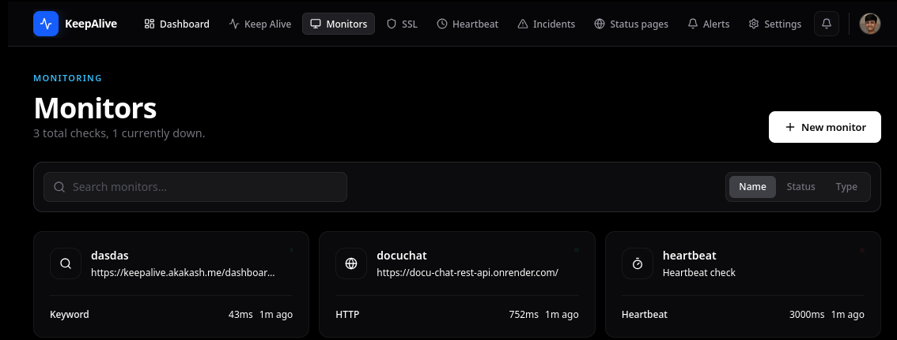
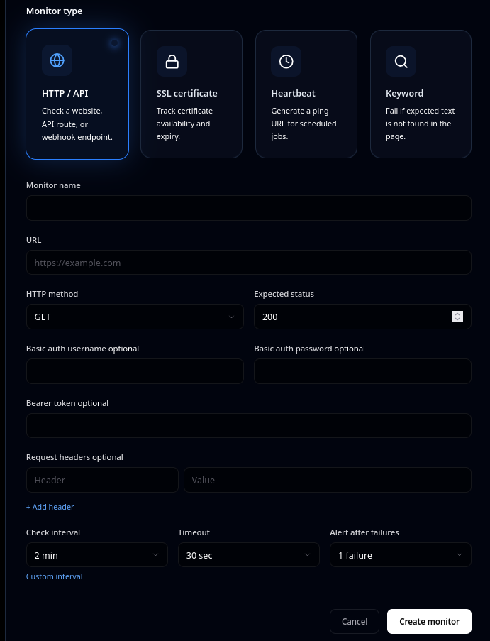
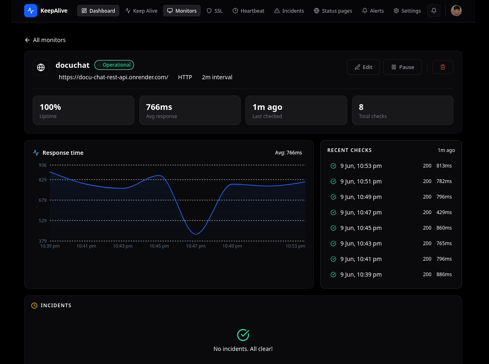

# KeepAlive

KeepAlive is an uptime monitoring app. It watches your websites, APIs, SSL certificates, and cron jobs, then alerts you when something breaks.

## Features

### 1. Website & API Monitoring (HTTP)

You give it a URL. It hits that URL every X minutes. If it gets a bad response, it alerts you.

**Use this for:**
- Your website is down
- Your API is returning errors
- Any HTTP endpoint you want to watch

- That's it. KeepAlive now checks `https://mysite.com` every 5 minutes. If it doesn't get a 200 response, it alerts you.

**You can also:**
- Set custom headers and request body
- Use Basic Auth or Bearer Token
- Choose HTTP method (GET, POST, PUT, PATCH, DELETE, HEAD)
- Set timeout (5, 10, 20, 30, or 60 seconds)

---

### 2. Keyword Monitoring

Same as HTTP monitoring, but instead of checking status code, it checks if a specific keyword exists in the response body.

**Use this for:**
- "Is my page showing the right content?"
- "Is the word 'error' appearing in my API response?"
- "Did my deployment actually go live?" (check if "v2.0" appears)

- If "Welcome to My App" is NOT found in the page, the monitor goes DOWN and you get alerted.

---

### 3. SSL Certificate Monitoring

Connects to port 443 of your domain, reads the SSL certificate, and tells you when it's about to expire.

**Use this for:**
- Never let your SSL certificate expire silently
- Get alerts at 30, 15, 7, 3, and 1 day before expiry
- Track certificate issuer


### 4. Cron / Heartbeat Monitoring

For scheduled jobs that don't have a URL (backups, scripts, cron tasks). You create a heartbeat monitor, it gives you a URL. Your cron job calls that URL when it finishes. If it stops calling, KeepAlive knows your job is broken.

**Use this for:**
- Database backup scripts
- Report generation crons
- Any scheduled task that should always run

**How to use:**

- Create a heartbeat monitor:
- The response gives you a `url`. Add this line at the end of your cron script:
```bash
curl 'url'
```
- Done. If your cron job crashes and stops calling the URL, KeepAlive alerts you.

---

### 5. Alerts & Notifications

When a monitor goes down or recovers, KeepAlive:
1. Creates an incident
2. Sends you an email (via Resend)
3. Creates an in-app notification

**Alert types:**
- `down` - Monitor is DOWN
- `recovery` - Monitor recovered to UP
- `ssl_expiry` - SSL certificate approaching expiry
- `cron_missed` - Heartbeat monitor missed its ping

**You can configure:**
- Which alerts you want via `PUT /api/notification-preferences`
- Toggle email alerts for down, recovery, and SSL expiry separately
- Shows every email sent or failed, with timestamps and error messages.

---

### 6. Public Status Pages

Create a public page that shows the health of your services to your customers.

**Use this for:**
- status.yourcompany.com
- Share uptime with customers
- Build trust by being transparent

**How to use:**

- Create a status page:

**No authentication needed. Shows:**
- Current status of each monitor
- 30-day uptime percentage
- Recent incidents

---

### 7. Dashboard

Central view of everything.

Returns:
- Total monitors
- Active monitors
- Up/Down/Unknown counts
- SSL warnings (certs expiring soon)
- Open incidents

Returns recent checks, incidents, and failures across all monitors.

---

## HOW TO USE
- **MAKE SURE TO LOGIN 
- **GO TO MONITOR PAGE AND CLICK  `+ NEW MONITOR`.**


- **SELECT MONITOR TYPE ACCORDING TO YOUR NEED.**



- **CHECK DASHBOARD**




## Quick Start
- Make sure to create a .env file and put credentials on that

```bash
# Start everything
docker compose up -d

# Open frontend
http://localhost:3000

# Open backend API
http://localhost:8080
```

